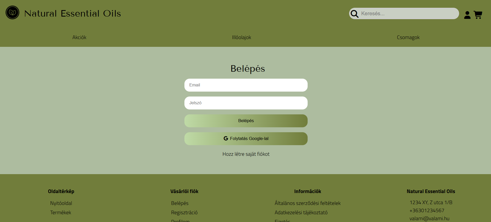

<p align="right">
  🌐 <a href="README_EN.md">English version</a>
</p>

# Natural Essential Oils Webshop Layout

**Nyelv:** HU Magyar | [GB English](README_EN.md)

## Képernyőképek


*Főoldal reszponzív megjelenése*


*Főoldal reszponzív megjelenése*


*Bejelentkezési képernyő*

Ez egy egyszerű webshop layout projekt HTML, CSS, JavaScript és Express.js használatával. A projekt célja, hogy bemutassa a reszponzív felhasználói felületet, mobil menüt, keresést, bejelentkezést és kosár funkciót.

## Funkciók

- Reszponzív fejléc és navigáció (desktop + mobil menü)
- Kereső mező
- Bejelentkezés / regisztráció oldalak
- Kosár ikon animáció (`addCart` gombok)
- Videó és termékek grid megjelenítés
- Dinamikusan betöltött CSS EJS sablonok segítségével
- Express.js backend a route-ok kezelésére

## Mappa struktúra

webshop-layout/
├─ public/
│  ├─ styles/
│  │  ├─ styles.css
│  │  ├─ login.css
│  ├─ images/
│  └─ script/
├─ views/
│  ├─ partials/
│  │  ├─ header.ejs
│  │  └─ footer.ejs
│  ├─ index.ejs
│  ├─ login.ejs
│  └─ register.ejs
├─ index.js
├─ package.json
└─ README.md

## Technológiák

- HTML5
- CSS3 (Grid, Flexbox, Media Queries)
- JavaScript (ES6)
- [Font Awesome](https://fontawesome.com/) ikonokhoz
- [Google Fonts](https://fonts.google.com/)
- Node.js + Express.js
- EJS sablon motor

## Telepítés

1. Klónozd a repót:

```bash
git clone https://github.com/felhasznalonev/webshop-layout.git
cd webshop-layout
```

2. Telepítsd a függőségeket: 

```bash
npm install
```

3. Indítsd a szervert nodemon-nal vagy node-dal: 

```bash
nodemon index.js
# vagy
node index.js
```

4. Nyisd meg a böngészőt a következő címen: http://localhost:3000

## Használat

- GET / – Főoldal
- GET /login – Bejelentkezés oldal
- GET /register – Regisztráció oldal
- A mobil menü a kis képernyőn a hamburger ikonra kattintva jelenik meg.

## Készítette

Név: Lukács Zita